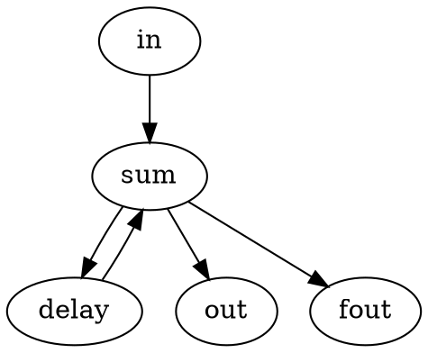
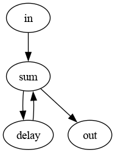

# dspflow

A digital systems simulator. Describe a digital system as a graph of basic
building blocks using the Graphiz `.dot` file format, then run the simulator.
It streams data samples through the graph and dumps the output data into files.


## Build

Java program:
```sh
make      # compile Java classes
make jar  # create an executable jar
make test # run JUnit tests
```


## Usage

Arguments: `<graph.dot> [iterations]`

```sh
java -cp bin Main examples/integrator.dot 8
```
or
```sh
java -jar dspsim.jar examples/integrator.dot 8
```

Once you have run the simulation and the data you care about got dumped into a
file like out.csv, then you can visualize this data using the python script in
this repository. First install the dependencies:

```sh
pip install -r requirements.txt
```

Then run the script:

Windows:
```sh
python python/plot.py examples/out.csv
```

MacOS / Linux:
```sh
python3 python/plot.py examples/out.csv
```


## Graph File Format

See the Graphviz documentation at [https://www.graphviz.org/documentation/](https://www.graphviz.org/documentation/)
for more details.



For now, the simulator program is headless. However, I found that this online
Graphviz tool is very helpful. [https://magjac.com/graphviz-visual-editor/](https://magjac.com/graphviz-visual-editor/)




## Nodes

The `type` attribute selects the node (case-insensitive):

| Type         | Parameters                                 | Inputs | Outputs |
|--------------|--------------------------------------------|:------:|:-------:|
| constant     | int value                                  | 0      | 1       |
| impulse      |                                            | 0      | 1       |
| sine         | int amplitude, int period, int phase = 0   | 0      | 1       |
| datain       | string file                                | 0      | 1       |
| gain         | int value                                  | 1      | 1       |
| lshift       | int value                                  | 1      | 1       |
| rshift       | int value                                  | 1      | 1       |
| sum          |                                            | 2+     | 1       |
| multiplier   |                                            | 2      | 1       |
| delay        | int delay = 1                              | 1      | 1       |
| integrator   |                                            | 1      | 1       |
| comb         | int value = 1                              | 1      | 1       |
| decimator    | int ratio                                  | 1      | 1       |
| interpolator | int ratio                                  | 1      | 1       |
| hold         | int ratio                                  | 1      | 1       |
| dataout      | string file = stdout                       | 1      | 0       |


## Data File Format

The data within the file expected by the datain node and created by the dataout
node is a column of comma separated values (the true separator is ,\n). For the
input data file, the list of values is the first contiguous slice of valid
numbers. Text before and after this are ignored. Any blank lines will end the
list. If more samples are requested from a datain node than it has data values,
it will return zeros.

### Example

```csv
Some Title,
1,
2,
3,
the following is ignored,
4,
5,
```


## Citations

[1] E. A. Lee and D. G. Messerschmitt, "Synchronous data flow," in Proceedings of the IEEE, vol. 75, no. 9, pp. 1235-1245, Sept. 1987
[2] E. A. Lee and D. G. Messerschmitt, "Static Scheduling of Synchronous Data Flow Programs for Digital Signal Processing," in IEEE Transactions on Computers, vol. C-36, no. 1, pp. 24-35, Jan. 1987

